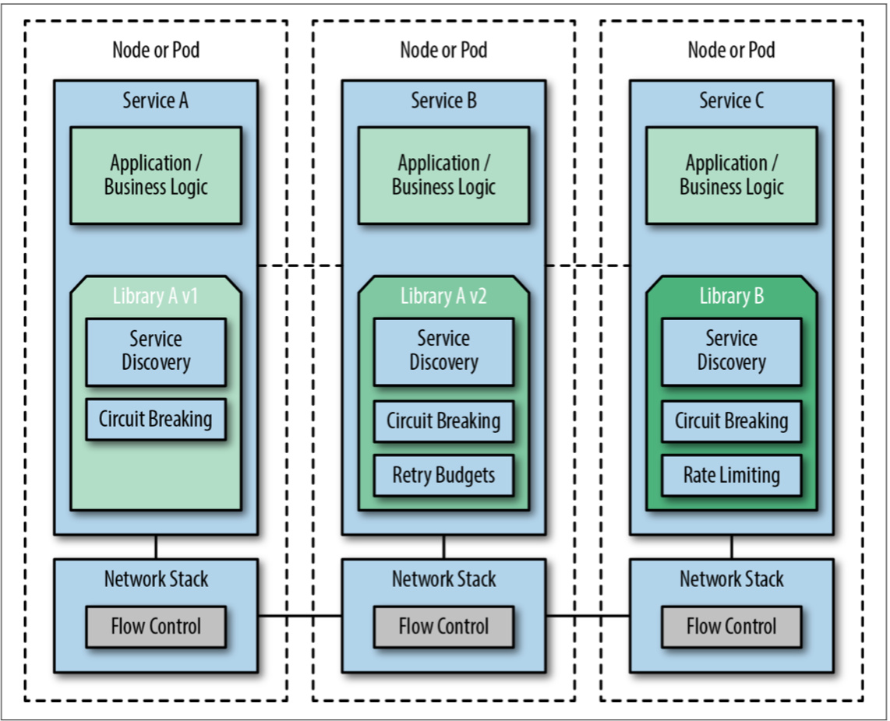

# Service Mesh技术对比

**注意：本书中的 Service Mesh 章节已不再维护，请转到 [istio-handbook](https://jimmysong.io/istio-handbook) 中浏览。**

这一章主要讲解Service Mesh技术之间的区别，Service Mesh与其他相关技术之间的区别，读者可以直接浏览该网站来查看对比：http://layer5.io/service-meshes/

为什么有了如Kubernetes这样的容器编排我们还需要Service Mesh呢，下表是对容器编排调度器的核心功能和缺少的服务级别能力对比。

| 核心能力                     | 缺少的服务级别能力            |
| ---------------------------- | ----------------------------- |
| 集群管理                     | 熔断                          |
| 调度                         | L7细粒度的流量控制            |
| 编排器和主机维护             | 混沌测试                      |
| 服务发现                     | 金丝雀部署                    |
| 网络和负载均衡               | 超时、重试、 budget和deadline |
| 有状态服务                   | 按请求路由                    |
| 多租户、多region             | 策略                          |
| 简单的应用监控检查和性能监控 | 传输层安全（加密）            |
| 应用部署                     | 身份和访问控制                |
| 配置和秘钥管理               | 配额管理                      |
| /                            | 协议转换（REST、gRPC）        |

以上是容器编排中缺少的服务级别的能力，当让类似Kubernetes这样的容器编排系统中也有服务管理的能力，如Ingress Controller，但是它仅仅负责集群内的服务对外暴露的反向代理，每个Ingress Controller的能力受限于Kubernetes的编程模型。对服务进行管理还可以通过例如Kong、基于云的负载均衡器、API Gateway和API管理来实现，在没有Service Mesh的时候还需要如[Finagle](https://finagle.github.io/blog/)、[Hystrix](https://github.com/Netflix/Hystrix)、[Ribbon](https://github.com/Netflix/ribbon)客户端库的加持。

下图是一个使用**客户端库**将应用与服务治理紧耦合的示意图。

从图中我们可以看到，应用程序代码与客户端度库紧耦合在一起，不同的服务团队需要一起协调超时和重试机制等。容器编排更适用于分布式应用，API Gateway通常只需要部署在系统边缘即可，不需要在每个应用中都部署，而Service Mesh却需要在每个服务或者说节点中部署。
